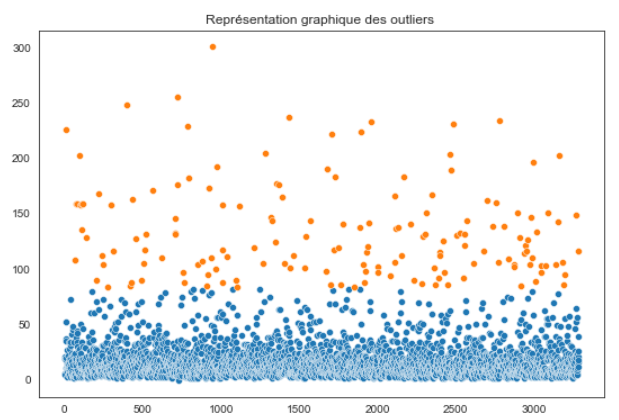
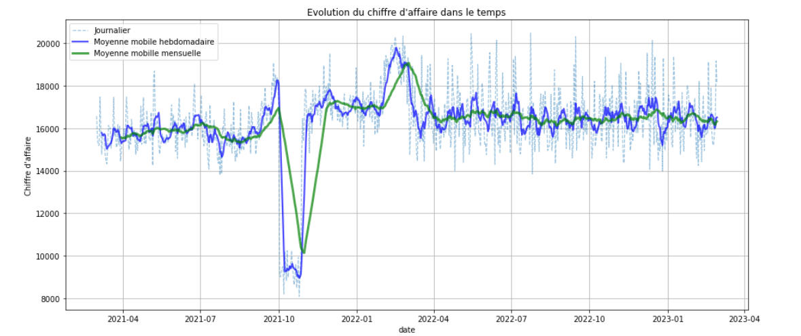
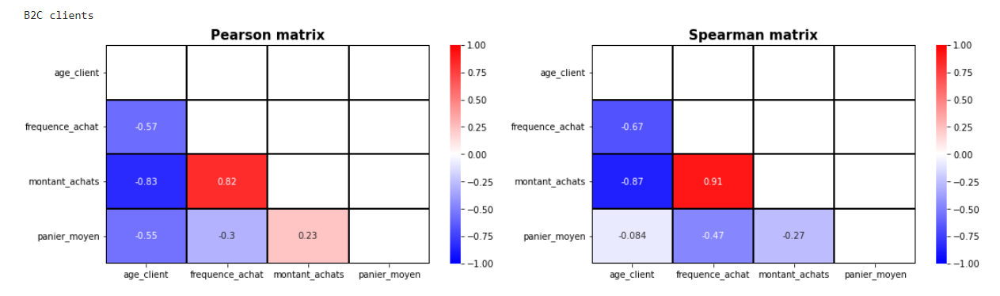

# Marketing Analysis with Python

In this project we analyzed tne Turnover & the customer's behavior of an online bookstore.

## [Data cleaning - Data exploration](./1_Exploration_Nettoyage.ipynb)

- Missing values cleaning
- Duplicated cleaning
- Outliers detection/ Analysis

## [Turnover Analysis](./2_Analyse_des_indicateurs_de_vente.ipynb)
- Turnover distrubution over clients and products categories.
- Turnover Evolution
- Rolling turnover
- Top sales

## [Customer behavior Analysis](./3_Analyse_comportements_clients.ipynb)
- chi-squared test
- Spearman test
- ANOVA test

